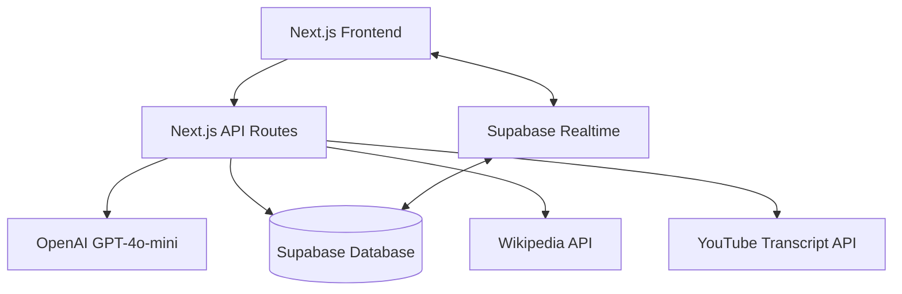

# Design Document

## Overview

TrivParty is architected as a full-stack Next.js application leveraging modern web technologies for real-time multiplayer trivia gameplay. The system integrates external content sources (Wikipedia, YouTube), AI-powered question generation, and real-time synchronization to deliver a seamless multiplayer experience.

## Architecture

### High-Level Architecture



### Technology Stack
- **Frontend**: Next.js 15 with App Router, React 19, TypeScript
- **Styling**: Tailwind CSS with shadcn/ui components
- **Backend**: Next.js API routes
- **Database**: Supabase (PostgreSQL with real-time subscriptions)
- **AI**: OpenAI GPT-4o-mini for quiz generation
- **Deployment**: Vercel for frontend and API routes

## Components and Interfaces

### Core Components

#### 1. Quiz Creation Flow
- **URLInputForm**: Accepts Wikipedia or YouTube URLs with validation
- **ContentExtractor**: Handles text extraction from different sources
- **QuizGenerator**: Interfaces with OpenAI API for question generation
- **QuizPreview**: Displays generated questions for host review

#### 2. Session Management
- **SessionCreator**: Creates new game sessions and generates join links
- **PlayerJoin**: Handles player registration and nickname entry
- **SessionLobby**: Shows connected players and session controls

#### 3. Gameplay Components
- **QuestionDisplay**: Shows current question and answer options
- **AnswerSubmission**: Handles player answer selection and submission
- **ScoreDisplay**: Real-time score updates and leaderboard
- **GameController**: Manages question flow and timing

#### 4. Real-time Communication
- **RealtimeProvider**: Supabase real-time connection management
- **GameStateSync**: Synchronizes game state across all clients
- **PlayerSync**: Manages player connections and disconnections

### API Interfaces

#### Content Extraction APIs
```typescript
// Wikipedia content extraction
POST /api/content/wikipedia
Body: { url: string }
Response: { content: string, title: string }

// YouTube transcript extraction  
POST /api/content/youtube
Body: { url: string }
Response: { transcript: string, title: string }
```

#### Quiz Generation API
```typescript
POST /api/quiz/generate
Body: { content: string, questionCount: number }
Response: {
  quiz: {
    id: string,
    questions: Array<{
      id: string,
      text: string,
      options: string[],
      correctAnswer: string,
      explanation: string
    }>
  }
}
```

#### Session Management APIs
```typescript
// Create session
POST /api/session/create
Body: { quizId: string, hostId: string }
Response: { sessionId: string, joinCode: string }

// Join session
POST /api/session/join
Body: { sessionId: string, nickname: string }
Response: { playerId: string, playerToken: string }

// Start game
POST /api/session/start
Body: { sessionId: string, hostId: string }
Response: { success: boolean }
```

## Data Models

### Database Schema

```sql
-- Quiz table
CREATE TABLE quizzes (
  id UUID PRIMARY KEY DEFAULT gen_random_uuid(),
  source_url TEXT NOT NULL,
  title TEXT NOT NULL,
  created_at TIMESTAMP WITH TIME ZONE DEFAULT NOW()
);

-- Questions table
CREATE TABLE questions (
  id UUID PRIMARY KEY DEFAULT gen_random_uuid(),
  quiz_id UUID REFERENCES quizzes(id) ON DELETE CASCADE,
  text TEXT NOT NULL,
  options JSONB NOT NULL, -- Array of 4 options
  correct_answer TEXT NOT NULL,
  explanation TEXT NOT NULL,
  question_order INTEGER NOT NULL
);

-- Sessions table
CREATE TABLE sessions (
  id UUID PRIMARY KEY DEFAULT gen_random_uuid(),
  quiz_id UUID REFERENCES quizzes(id) ON DELETE CASCADE,
  host_id UUID NOT NULL,
  join_code TEXT UNIQUE NOT NULL,
  status TEXT DEFAULT 'waiting', -- waiting, active, completed
  current_question_id UUID REFERENCES questions(id),
  created_at TIMESTAMP WITH TIME ZONE DEFAULT NOW()
);

-- Players table
CREATE TABLE players (
  id UUID PRIMARY KEY DEFAULT gen_random_uuid(),
  session_id UUID REFERENCES sessions(id) ON DELETE CASCADE,
  nickname TEXT NOT NULL,
  score INTEGER DEFAULT 0,
  joined_at TIMESTAMP WITH TIME ZONE DEFAULT NOW()
);

-- Player answers table
CREATE TABLE player_answers (
  id UUID PRIMARY KEY DEFAULT gen_random_uuid(),
  player_id UUID REFERENCES players(id) ON DELETE CASCADE,
  question_id UUID REFERENCES questions(id) ON DELETE CASCADE,
  selected_answer TEXT NOT NULL,
  is_correct BOOLEAN NOT NULL,
  answered_at TIMESTAMP WITH TIME ZONE DEFAULT NOW()
);
```

### TypeScript Interfaces

```typescript
interface Quiz {
  id: string;
  sourceUrl: string;
  title: string;
  createdAt: string;
  questions: Question[];
}

interface Question {
  id: string;
  quizId: string;
  text: string;
  options: string[];
  correctAnswer: string;
  explanation: string;
  questionOrder: number;
}

interface Session {
  id: string;
  quizId: string;
  hostId: string;
  joinCode: string;
  status: 'waiting' | 'active' | 'completed';
  currentQuestionId?: string;
  createdAt: string;
}

interface Player {
  id: string;
  sessionId: string;
  nickname: string;
  score: number;
  joinedAt: string;
}

interface GameState {
  session: Session;
  players: Player[];
  currentQuestion?: Question;
  timeRemaining?: number;
  showResults: boolean;
}
```

## Error Handling

### Content Extraction Errors
- Invalid URL format validation
- Network timeout handling for external APIs
- Content parsing failures with fallback messages
- Rate limiting for API calls

### Quiz Generation Errors
- OpenAI API failures with retry logic
- Invalid content format handling
- Question validation failures
- Quota exceeded scenarios

### Real-time Connection Errors
- WebSocket disconnection recovery
- Player reconnection handling
- Session state synchronization conflicts
- Network interruption graceful degradation

### User Experience Errors
- Loading states for all async operations
- Toast notifications for error feedback
- Graceful fallbacks for failed operations
- Clear error messages with actionable steps

## Testing Strategy

### Unit Testing
- Component rendering and interaction tests using Jest and React Testing Library
- API route testing with mock external services
- Utility function testing for content parsing and validation
- Database model validation and constraint testing

### Integration Testing
- End-to-end quiz creation and gameplay flow
- Real-time synchronization testing with multiple clients
- External API integration testing with mock responses
- Database transaction and rollback testing

### Performance Testing
- Load testing for concurrent sessions
- Real-time message throughput testing
- Database query optimization validation
- Frontend bundle size and loading performance

### User Acceptance Testing
- Cross-browser compatibility testing
- Mobile responsiveness validation
- Accessibility compliance testing (WCAG 2.1)
- User flow testing for complete game sessions

## Security Considerations

### Data Protection
- Input sanitization for all user-provided content
- SQL injection prevention through parameterized queries
- XSS protection through proper content escaping
- Rate limiting on all public API endpoints

### Session Security
- Secure session token generation and validation
- Player authentication through session-based tokens
- Host authorization for session control actions
- Automatic session cleanup and expiration

### External API Security
- API key protection through environment variables
- Request validation and sanitization
- Response data validation and filtering
- Error message sanitization to prevent information leakage